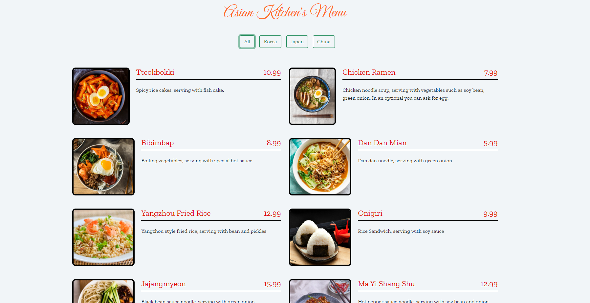
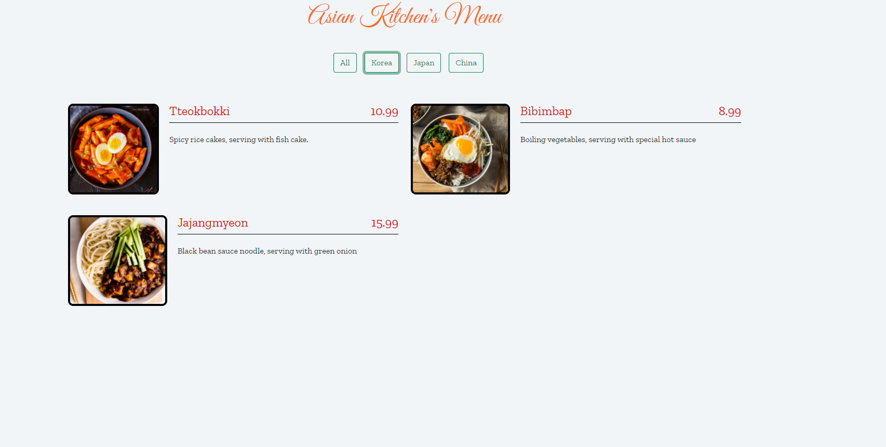
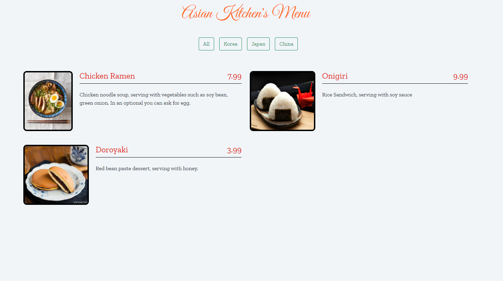
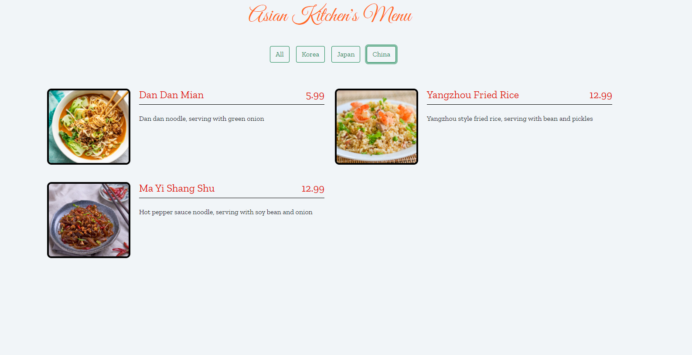

# React Native İle Mobile App Patikası
## Javascript 3. ödev 

JS içerisinde obje olarak tutulan menüyü anasayfamıza push ettik.

<b>All Page</b>
---

<b>Korea Page</b>
---

<b>Japan Page</b>
---

<b>China Page</b>
---
